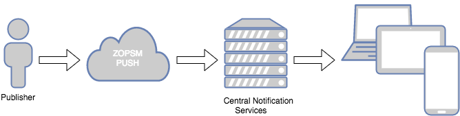
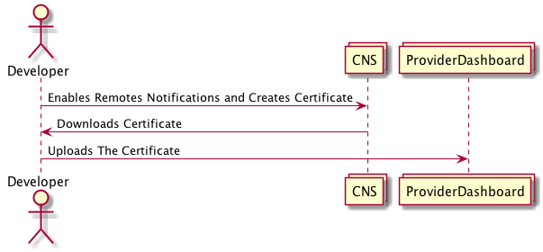
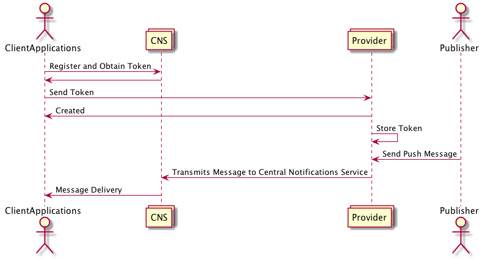

# Push Service documentation

Zopsm Push Service provides a high volume and reliable push notification service
for websites and mobile applications.

...

## Conventions & Terminology

Conventions and terminology used in the push service's documentation placed in
the table below.

| Name | Description |
|------|-------------|
| __provider__ | Zopsm Push Service |
| __central notification service__ | GCM, APNs, WNS with respect to devices |
| __consumer__ | Registered user of application |
| __client__ | Recipient of the pushed message. Generally represents the client-application pair. Clients can be belonged to an authorized or anonymous _consumer_ of the customer's application. |
| __publisher__ | Actual publisher of the message to be pushed to the _clients_ (Account Manager in SaaS Dashboard) |
| __application__ | The account that account manager or developer created on the Zopsm Dashboard |
| __client application__ | Applications that are used by consumers(end-users) of the customer |


## System Overview

Provider gives publisher a handy mechanism that he/she can easily send push
messages to his/her subscribers. Basically,
- He/she post the message which is desired to deliver to subscribers from
provider dashboard or makes a POST request to Zopsm Push Service endpoint.
- Provider takes the message, determines its audience, and with respect to the
audience it delivers the message to the one or couple of Central Notification
Services.
- Central Notification Services are responsible for the delivery of the message.
It is also responsible for the acknowledgement. If Central Notification Services
fails to deliver the messages, they notify the provider.
- Clients are supposed to be registered to receive the messages from Central
Notification Services. See [Register Clients](/#register-clients)




Following is a list of what needs to be done to set the mechanism up for
successful push messages:

> It is assumed that you already have an application on Zopsm SaaS dashboard, or
you created one before going through the list below.

1. Publisher must add Zopsm Push Message Service to its application via
dashboard.
2. Publisher must [configure](/#configuring-application) his/her application by adding platforms 
which client application runs on.
3. Publisher must [configure his/her client application(s)](/#configuring-client-applications) in a 
way that it will register itself to its own Central Notification Service on launch, receive a
token from Central Notification Service after registration and whenever token changes, and finally 
sends it to the provider's endpoint via POST request.

Configuration between the publisher and dashboard of provider can be summarized by following 
diagram:



After applying the list items above, the flow can be represented as in the following diagram:




### Adding Push Message To Application via Dashboard

TODO

### Configuring Client Applications

Publisher must configure at least one of the following platforms to send push
messages. Configuration steps are explained in the following subsections.

- Google Chrome and Mozilla Firefox
- Apple Safari
- [Apple iOS](/#apple-ios)
- Google Android
- Windows Phone 8.0
- Windows Phone 8.1+
- Amazon Fire
- Mac OS X
- Google Chrome Apps & Extensions
- Amazon Alexa
___
#### Google Chrome and Mozilla Firefox
TODO
___
#### Apple Safari
TODO
___
#### Apple iOS

Configuring iOS client application requires:

1. [Enabling remote notifications](/#enabling-remote-notifications)

2. [Generating An iOS Push Certificate](/#generating-an-ios-push-certificate)

3. [Uploading iOS Push Certificate to provider via dashboard](/#uploading-ios-push-certificate-to-provider-via-dashboard)

4. [Registering your client application with Apple Push Notification service
(APNs) and receiving an app-specific device token](/#registering-your-client-application-with-apns-and-receiving-an-app-specific-device-token)

5. [Send device token to provider](/#send-device-token-to-provider)

6. [Handling incoming remote notifications in client application](/#handling-incoming-remote-notifications-in-client-application)


##### Enabling remote notifications

1. In the project editor, choose a target and click Capabilities.

2. In the Push Notifications section, click the switch to turn it from OFF to ON.

[See for more...](http://help.apple.com/xcode/mac/current/#/devdfd3d04a1?sub=dev73a37248c)

##### Generating An iOS Push Certificate

1. Open Keychain Access on your Mac OS X system. It may be located in
"Applications" > "Utilities" > "Keychain Access"

2. Select "Keychain Access">"Certificate Assistant">"Request a Certificate From
a Certificate Authority..."

3. Select the "Save to disk" option and enter your information in the required
fields. This creates a certification request file that will be used later.

4. Select your app from the [Apple's Developer site](https://developer.apple.com/account/ios/identifier/bundle)
and press "Edit"

5. Scroll down to the bottom and enable Push Notifications. Press Done, but do
not configure either Production or Development certificate. Instead, go to
[Add iOS Certificate](https://developer.apple.com/account/ios/certificate/create)
and select "Apple Push Notification service SSL (Sandbox & Production)" and
click Continue. This certificate will be applicable to both Sandbox and
Production environments, so you do not need a separate key for each one.

6. Choose an App ID from the App ID pop-up menu, and click Continue.

7. Press Continue

8. Press "Choose File..", select the "certSigningRequest" file you saved in
step 1, press open, and then press "Generate".

9. Press Download to save your certificate

10. Open the .cer file you downloaded in the last step by double clicking on it
in Finder.

11. After a few seconds the "Keychain Access" program should pop up. Select
Login > My Certificates then right click on your key in the list and select
"Export"

12. Give the file a unique name using the .p12 extension, and press save. You
will have an option to protect the file with a password. If you add a password,
you need to enter this same password on dashboard.

[See for more...](http://help.apple.com/xcode/mac/current/#/dev11b059073?sub=dev73a37248c)

##### Uploading iOS Push Certificate to provider via dashboard
TODO

##### Registering your client application with APNs and receiving an app-specific device token

###### Obtaining a Device Token in iOS and tvOS

```objective-c

// objective-c
- (void)applicationDidFinishLaunching:(UIApplication *)app {
    // Configure the user interactions first.
    [self configureUserInteractions];

   // Register for remote notifications.
    [[UIApplication sharedApplication] registerForRemoteNotifications];
}

// Handle remote notification registration.
- (void)application:(UIApplication *)app
        didRegisterForRemoteNotificationsWithDeviceToken:(NSData *)devToken {
    // Forward the token to your provider, using a custom method.
    [self enableRemoteNotificationFeatures];
    [self forwardTokenToServer:devTokenBytes];
}

- (void)application:(UIApplication *)app
        didFailToRegisterForRemoteNotificationsWithError:(NSError *)err {
    // The token is not currently available.
    NSLog(@"Remote notification support is unavailable due to error: %@", err);
    [self disableRemoteNotificationFeatures];
}

```

```swift

// swift
func application(_ application: UIApplication,
                 didFinishLaunchingWithOptions launchOptions: [UIApplicationLaunchOptionsKey: Any]?) -> Bool {
    // Configure the user interactions first.
    self.configureUserInteractions()

    // Register with APNs
    UIApplication.shared.registerForRemoteNotifications()
}

// Handle remote notification registration.
func application(_ application: UIApplication,
                 didRegisterForRemoteNotificationsWithDeviceToken deviceToken: Data){
    // Forward the token to your provider, using a custom method.
    self.enableRemoteNotificationFeatures()
    self.forwardTokenToServer(token: deviceToken)
}

func application(_ application: UIApplication,
                 didFailToRegisterForRemoteNotificationsWithError error: Error) {
    // The token is not currently available.
    print("Remote notification support is unavailable due to error: \(error.localizedDescription)")
    self.disableRemoteNotificationFeatures()
}
```
[See for more...](https://developer.apple.com/library/content/documentation/NetworkingInternet/Conceptual/RemoteNotificationsPG/HandlingRemoteNotifications.html#//apple_ref/doc/uid/TP40008194-CH6-SW4)

###### Obtaining a Device Token in macOS
```objective-c
//objective-c
- (void)applicationDidFinishLaunching:(NSNotification *)notification {
    // Configure the user interactions first.
    [self configureUserInteractions];

    [NSApp registerForRemoteNotificationTypes:(NSRemoteNotificationTypeAlert | NSRemoteNotificationTypeSound)];
}

- (void)application:(NSApplication *)application
        didRegisterForRemoteNotificationsWithDeviceToken:(NSData *)deviceToken {
    // Forward the token to your provider, using a custom method.
    [self forwardTokenToServer:deviceToken];
}

- (void)application:(NSApplication *)application
        didFailToRegisterForRemoteNotificationsWithError:(NSError *)error {
    NSLog(@"Remote notification support is unavailable due to error: %@", error);
    [self disableRemoteNotificationFeatures];
}

```

```swift
//swift
func applicationDidFinishLaunching(_ aNotification: Notification) {
    // Configure the user interactions first.
    self.configureUserInteractions()

    NSApplication.shared().registerForRemoteNotifications(matching: [.alert, .sound])
}

// Handle remote notification registration.
func application(_ application: NSApplication,
                 didRegisterForRemoteNotificationsWithDeviceToken deviceToken: Data) {
    // Forward the token to your provider, using a custom method.
    self.forwardTokenToServer(token: deviceToken)
}

func application(_ application: NSApplication,
                 didFailToRegisterForRemoteNotificationsWithError error: Error) {
    // The token is not currently available.
    print("Remote notification support is unavailable due to error: \(error.localizedDescription)")
}

```
[See for more...](https://developer.apple.com/library/content/documentation/NetworkingInternet/Conceptual/RemoteNotificationsPG/HandlingRemoteNotifications.html#//apple_ref/doc/uid/TP40008194-CH6-SW6)

##### Send device token to provider

Client application is responsible for sending app-specific device token to provider __whenever__ 
obtains it from APNs. See the [reference](/#api-reference).

##### Handling incoming remote notifications in client application
TODO

___
#### Google Android
TODO
___
#### Windows Phone 8.0
TODO
___
#### Windows Phone 8.1+
TODO
___
#### Amazon Fire
TODO
___
#### Mac OS X
TODO
___
#### Google Chrome Apps & Extensions
TODO
___
#### Amazon Alexa
TODO
___

## API Reference

| Resource                       | Request | Description                       |
|--------------------------------|---------|-----------------------------------|
| /v1/push/clients               | POST    | Register a device to the provider |
| /v1/push/clients               | GET     | Get list of devices               |
| /v1/push/clients/{client_id}   | PUT     | Updates a device's information    |
| /v1/push/clients/{client_id}   | GET     | Single get operation              |
| /v1/push/messages              | POST    | Posts a push message              |
| /v1/push/messages              | GET     | Gets a list of push messages      |
| /v1/push/messages/{message_id} | GET     | Get a single push message         |

### Resources 

#### Client

Client resource represents client-application pair in the system. Each client application must 
register itself to the push notification server of its own platform and obtain a token after 
registration or whenever token changes. 

Client application is responsible for sending this token to provider when it is obtained. 
On each delivery of the token, the client must pass some information to make itself classifiable by 
giving provider some behavioral information about its presence, online frequency, language of 
device etc.
 
__Attributes__:

| attr         | description                                           |
| ------------ | ------------------------------------------------------|
| clientId     | unique identifier of clients                          |
| language     | client's language                                     |
| firstSession | first session time                                    |
| lastSession  | last session time                                     |
| appVersion   | version of client application                         |
| deviceType   | device type of application runs on                    |
| email        | email                                                 |
| country      | country                                               |
| osVersion    | os version                                            |
| userTags     | tags                                                  |

#### Message

__Attributes__: 

| attr        | description                                           |
| ----------- | ------------------------------------------------------|
| id          | unique identifier of messages                         |
| title       | title of message                                      |
| body        | body of message                                       |
| type        | automated, scheduled, ordinary                        |
| language    | language                                              |
| icon        | icon                                                  |
| image       | image                                                 |
| badge       | badge                                                 |
| status      | pending, delivered, unreachable, invalid              |


#### Segments

__Sending Filters__:

List of operators: 
- intersection 
- union 
- difference

If only one operator will be applied on the return values of the given expressions, following can 
 be sent.
```json
{
    "operator": "intersection",
    "expressions": [
      {
        "field": "tag", 
        "key": "level", 
        "relation": "=", 
        "value": "10"
      }, 
      {
        "field": "amount_spent", 
        "relation": ">", 
        "value": "0"
      }
    ]
}
```

If more complicated logic is required like nested expressions:

```json
{
    "operator": "union",
    "first": {
      "field": "tag", 
      "key": "level", 
      "relation": "=", 
      "value": "10"
    },
    "second": {
      "operator": "difference",
      "expressions": [
        {
          "field": "tag", 
          "key": "level", 
          "relation": "=", 
          "value": "10"
        }, 
        {
          "field": "amount_spent", 
          "relation": ">", 
          "value": "0"
        }
      ]
    }
}
```

> Difference operator interprets the given expressions in the given order. 
>
>```json
>{
>    "operator": "difference",
>    "expressions": [
>      "EXPRESSION A", 
>      "EXPRESSION B"
>    ]
>}    
>```
> Interpreted version of these is `EXPRESSION A` - `EXPRESSION B` 